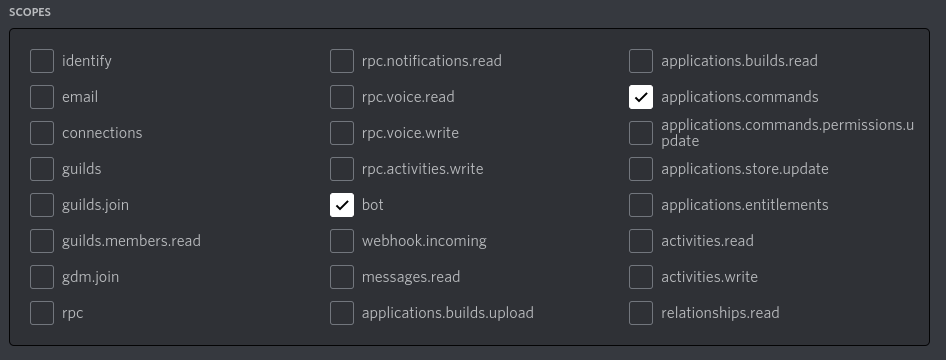

# Umi (Python Rewrite)
Created with discord.py/PyCord, Python3.9+ Required.

## Getting Bot Up & Running
- Create a bot profile and invite it with the ``bot`` and ``applications.commands`` scope.

- Create a file named ``.env``
- In the ``.env`` file, add the following line ``BOT_TOKEN=<GENERATED_BOT_TOKEN>``, make sure to change <GENERATED_BOT_TOKEN> to your actual bot token.
- Run the ``deploy.sh`` script to get your bot up and running! This script installs all of the necessary dependencies to run this bot.
  - You may run the bot by typing in ``chmod 0755 deploy.sh && ./deploy.sh``.